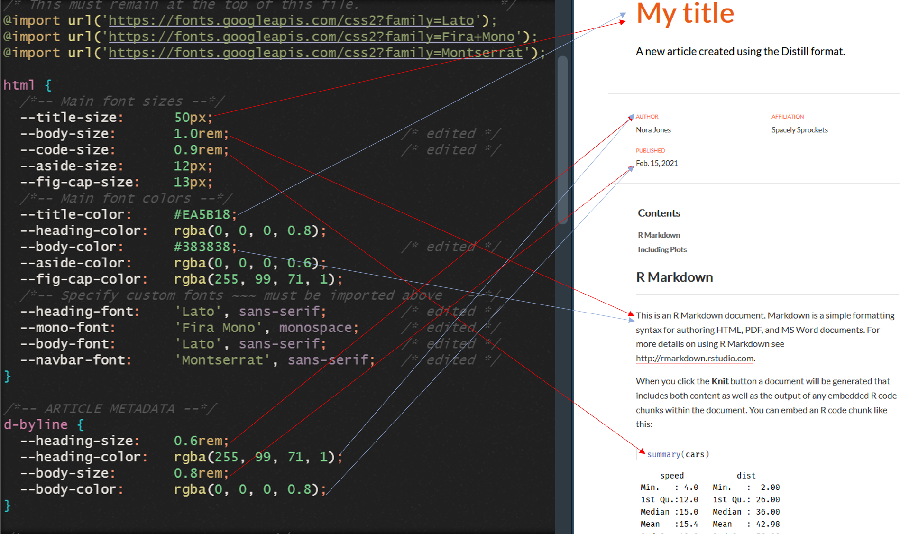
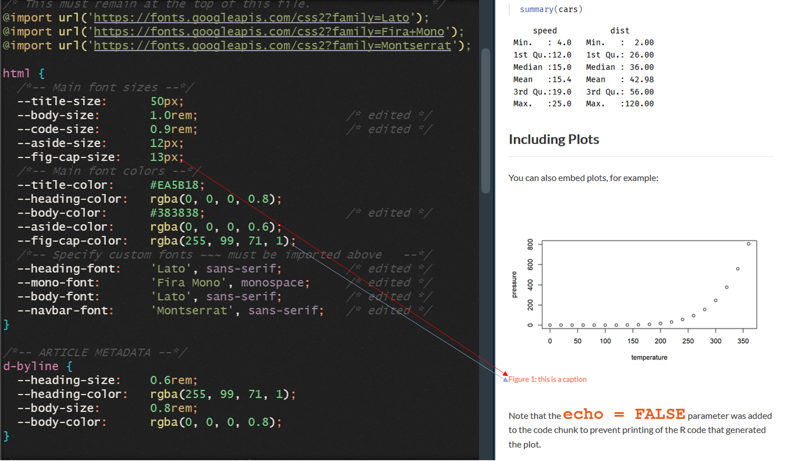

I am pretty new to HTML/CSS world and do not completely understand a lot of CSS theming options in Rmarkdown. For my own reference, and for anyone who'd like to benefit, I have highlighted the different theme options in the source CSS file that change elements on a distill article page.  

The [source CSS file](https://github.com/shannonpileggi/pipinghotdata_distill/blob/master/theme.css) shown below is from the [piping hot data website](https://www.pipinghotdata.com/), also listed on the distill package website examples page.  

  
   
   
   
  
    
    
    



The following video is a timelapse of me changing and knitting the different theme options:    

 
```{r, echo=FALSE}
library(vembedr)
embed_youtube("HDu3cqQUe-c", width=800, height = 400) %>%
  use_bs_responsive() %>%
  use_rounded()
```


